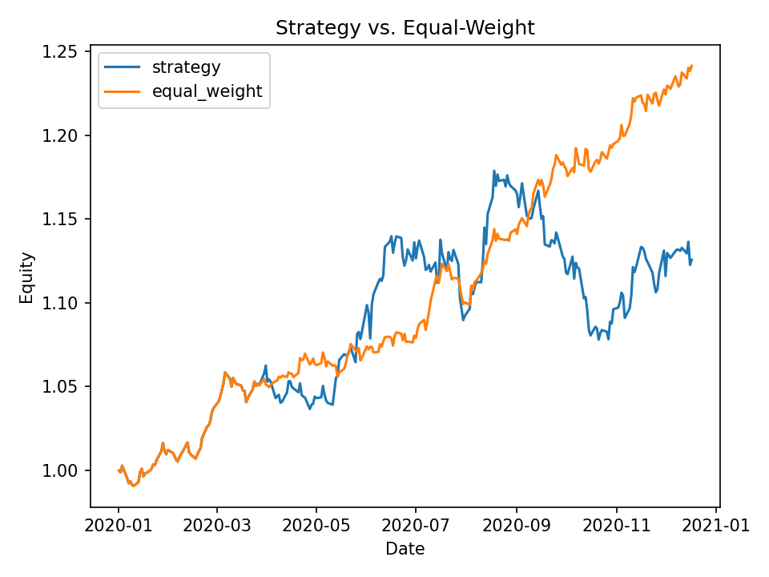
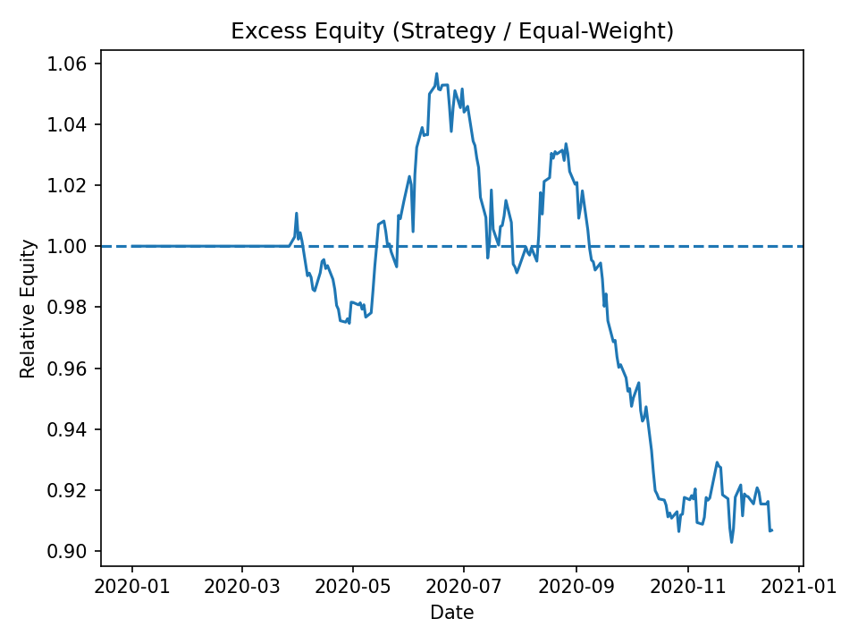
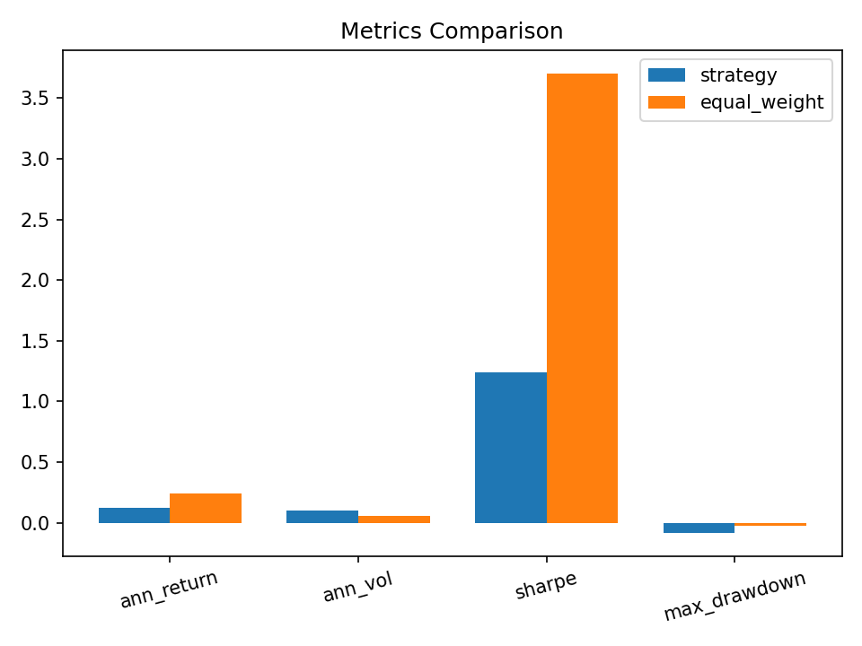
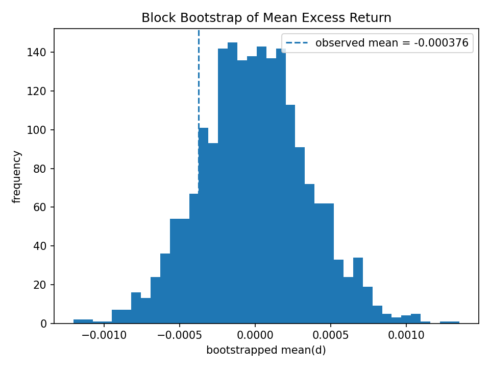

# HKML — Minimal Backtest Demo (Equal‑Weight vs Top‑K via Custom Weights Module)

> Reproducible in **~60 seconds**: DuckDB → wide price matrix → Equal‑Weight baseline vs **Top‑K (custom weights module)** → A/B with block bootstrap.

This demo focuses on a *custom, parameterizable* Top‑K momentum strategy file (`my_simple_strategy.py`).  
The built‑in `--strategy topk` path is intentionally **not** included here.

---

## Example outputs (at a glance)

<p align="center">
  
  
</p>
<p align="center">
  
  
</p>

<sub>Note: a flat segment at 1.0 in the excess‑equity plot is expected when the initial weights match Equal‑Weight and rebalances apply the next day.</sub>

---

## Key numbers (single sample run)

**Metrics (from `metrics.json`)**

- **Strategy** — ann. return 12.56%, ann. vol 9.95%, Sharpe 1.24, max drawdown -8.55%.
- **Equal‑Weight** — ann. return 24.13%, ann. vol 5.88%, Sharpe 3.70, max drawdown -2.18%.

**A/B block bootstrap (from `abtest.json`)**

- `n=252`, `block=10`, `B=2000`
- Δ mean (strategy − equal‑weight): -0.000376 / day (-0.0376% ≈ -3.76 bps/day)
- Δ Sharpe: -2.47
- one‑sided p‑value (strategy > equal‑weight): 0.860

> On this sample, Equal‑Weight outperforms the custom strategy — that’s the point of a fair, honest baseline.

---

## Run in 60 seconds

**One‑click scripts**

- **Windows**: [run_demo.bat](./run_demo.bat) ([raw](./run_demo.bat?raw=1))
- **macOS / Linux**: [run_demo.sh](./run_demo.sh) ([raw](./run_demo.sh?raw=1))

### 0) Install (editable)
```bash
pip install -U pip
pip install -e .
```

### 1) Create a tiny offline dataset (DuckDB)
```bash
python scripts/make_tiny_db.py --out data/tiny.duckdb --table ohlcv_hk   --tickers 0700.HK,3690.HK,9988.HK,0005.HK,0001.HK --rows 252 --start 2020-01-01 --seed 42
```

### 2) Run with the **custom strategy file** (environment‑variable configurable)
> The module reads environment variables at **import time**.

**macOS/Linux**
```bash
export HKML_LOOKBACK=60   # lookback trading days (default 60)
export HKML_TOPK=2        # number of winners to hold (default 2)
python -m hkml.simple_cli --db data/tiny.duckdb --table ohlcv_hk --rebal W   --weights-mod ./my_simple_strategy.py --tc-bps 10 --outdir outputs   --abtest --ab-block 10 --ab-B 2000
```

**Windows (CMD / Anaconda Prompt)**
```bat
set HKML_LOOKBACK=60
set HKML_TOPK=2
python -m hkml.simple_cli --db data\tiny.duckdb --table ohlcv_hk --rebal W ^
  --weights-mod ".\my_simple_strategy.py" --tc-bps 10 --outdir outputs ^
  --abtest --ab-block 10 --ab-B 2000
```

Run completes with artifacts in `outputs/`:
- `weights_strategy.csv` / `weights_equal_weight.csv` (two weight streams)
- `portfolio_returns.csv` (daily returns of both portfolios)
- `metrics.json` (KPIs for both)
- `abtest.json` (block‑bootstrap significance)
- `equity_curve.png`, `excess_equity.png`, `bootstrap_hist.png` (figures)

> Note: when a strategy returns empty/invalid weights, the engine **falls back to Equal‑Weight** (keeps the pipeline robust).

---

## Repo layout (key items)
```
src/hkml/            # Backtest engine + CLI (python -m hkml.simple_cli)
scripts/             # Helper scripts (make_tiny_db.py / fetch_yahoo_hk_db.py)
data/                # Local DuckDB (recreated by scripts; gitignored)
docs/                # Small fixed demo images for README
outputs*/            # Run artifacts (figures + json; gitignored)
pyproject.toml       # Editable install (pip install -e .)
README.md            # This file
```

---

## Troubleshooting

- **Top‑K looks identical to Equal‑Weight**  
  Most likely `TOP_K ≥ tradable universe` (selecting all ≈ equal‑weight), or the strategy returned empty/invalid weights and the engine fell back. Lower `TOP_K` or use `--rebal W`.

- **Custom strategy not picked up**  
  Pass an **absolute path** to `--weights-mod`, or ensure you run from the repo root.

- **Empty data**  
  Check `--db/--table` and ensure the DuckDB file and table exist (Step 1).

---

## License
MIT — feel free to adapt for interview demos.


